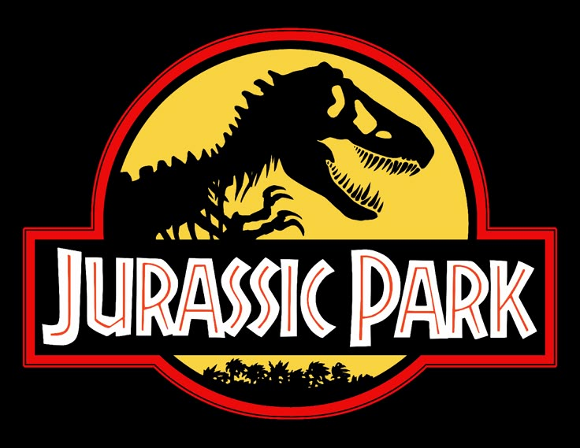

# Página de Tributo: Jurassic Park 🦖

Este é um projeto de uma página HTML dedicada ao filme **Jurassic Park (1993)**, dirigida por Steven Spielberg. O objetivo é praticar a criação de páginas com HTML e CSS, usando estrutura semântica, imagens, listas, citações e links externos.

## 📸 Prévia

> Imagens ilustrativas do filme e bastidores estão incluídas.

## 🧠 Conteúdo da Página

- ✅ Cabeçalho com título e subtítulo
- ✅ Imagem de destaque com legenda
- ✅ Biografia de Steven Spielberg e resumo do filme
- ✅ Citações marcantes dos personagens e do diretor
- ✅ Lista com curiosidades sobre os bastidores
- ✅ Galeria de imagens com cenas do filme
- ✅ Link para saber mais no site da Universal Pictures

## 🛠️ Tecnologias Usadas

- **HTML5** para estruturação da página
- **CSS3** para estilização (arquivo externo: `styles.css`)

## 📁 Estrutura de Pastas

projeto-jurassic/
├── index.html
├── css/
│ └── styles.css
└── img/
├── logo.jpg
├── t-rex.jpg
├── scene2.webp
└── scene3.jpg

## ✍️ Autor

Desenvolvido por **Caio Henrique** – Projeto de prática com HTML e CSS.

---

